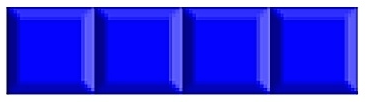
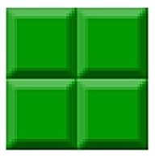
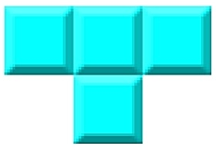
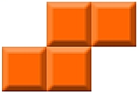
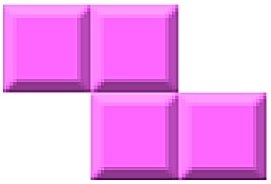
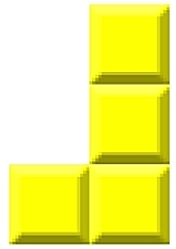
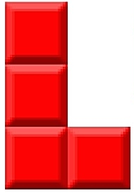

# BrickGame v1.0 (Classic Tetris)

### Описание
BrickGame v1.0 — игра "Тетрис" на языке С с использованием компилятора GCC и библиотеки ncurses для текстового интерфейса. Игра поддерживает семь стандартных фигур ("тетримино") и основную логику тетриса, включая падение фигур, повороты, проверку заполненных линий и завершение игры.

### Фигуры
В классическом Тетрисе используются семь типов фигур, каждая из которых состоит из четырёх блоков, расположенных в уникальной форме. Ниже перечислены названия и описания этих фигур:

1. **I-тетромино** (прямая):
   - Фигура из четырёх блоков, выстроенных в линию. Может располагаться вертикально или горизонтально.

   

2. **O-тетромино** (квадрат):
   - Квадратная фигура 2x2, состоящая из четырёх блоков. Не меняет форму при повороте.

   

3. **T-тетромино**:
   - Фигура в форме буквы "T": три блока в линию и один дополнительный блок, прикрепленный к центру.

   

4. **S-тетромино**:
   - Зигзагообразная фигура, похожая на букву "S". Состоит из двух блоков на каждом уровне, сдвинутых относительно друг друга.

   

5. **Z-тетромино**:
   - Похожа на S-тетромино, но с противоположной ориентацией, напоминая букву "Z".

   

6. **J-тетромино**:
   - Фигура, напоминающая букву "J". Состоит из трёх блоков в линии и одного блока, присоединенного сбоку.

   

7. **L-тетромино**:
   - Фигура, напоминающая букву "L". Состоит из трёх блоков в линии и одного блока, присоединенного с противоположной стороны.

   

### Логика игры и конечный автомат
Игра разработана на основе конечного автомата для упрощения управления состояниями. Основные состояния игры:
- `WAITING_FOR_INPUT`: ожидание действия игрока (перемещение или поворот фигуры).
- `MOVING_PIECE`: текущее состояние движения или падения фигуры.
- `CHECKING_LINES`: проверка и удаление заполненных линий после установки фигуры.
- `GAME_OVER`: завершение игры, если нет места для новой фигуры.

Каждое состояние и переход между ними структурируют игровой процесс, обеспечивая плавный и последовательный игровой опыт.

